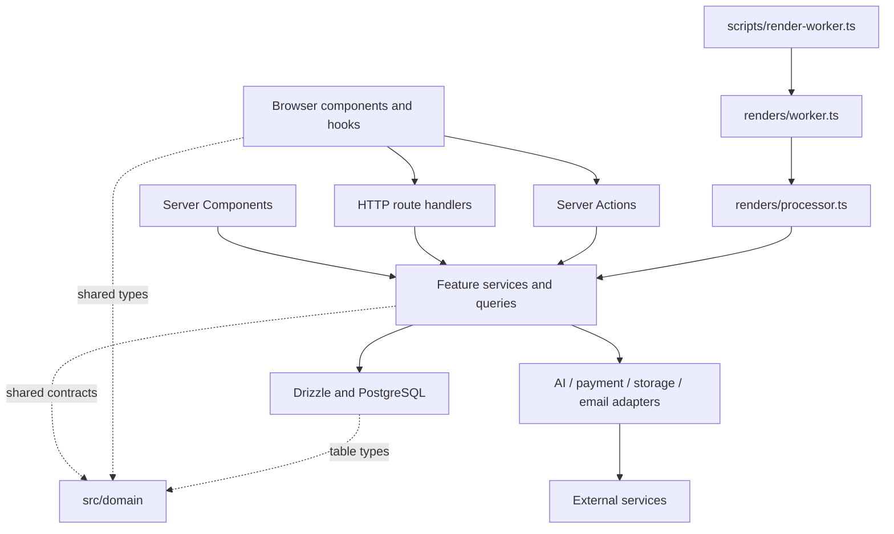

# RenderAI architecture

RenderAI is a modular monolith: a Next.js web application and a separate queue worker share the same domain services, PostgreSQL database, and storage/provider implementations. Both processes are packaged in the same image. The browser owns interaction state; the server owns authorization, credits, job state, and provider credentials.

## Module map

| Location | Responsibility |
|---|---|
| `src/app/` | Routes, layouts, server-rendered pages, server actions, and HTTP adapters |
| `src/app/(auth)/` | Login, registration, verification, and recovery pages |
| `src/app/(app)/` | Authenticated application pages; `admin/` has an additional admin guard |
| `src/app/api/` | HTTP input validation, session checks, rate limits, and response mapping |
| `src/components/ui/` | Reusable UI primitives without business services |
| `src/components/app/` | Application UI; the render studio has its own subdirectory |
| `src/components/auth/`, `brand/` | Authentication forms and public/marketing presentation |
| `src/hooks/` | Shared browser hooks such as queue/status polling |
| `src/domain/` | Framework-independent shared types, render enums, and error classes |
| `src/lib/<feature>/` | Feature services, queries, and pure helpers; flat modules such as `credits.ts` remain small enough to navigate directly |
| `src/lib/providers/` | AI and payment provider interfaces, implementations, and runtime factories |
| `src/lib/storage/`, `email/` | Storage and email integrations, interfaces, and related services |
| `src/lib/validations/` | Zod input schemas; render enums come from `src/domain/types.ts` |
| `src/lib/api/errors.ts` | Maps domain failures to HTTP status and public payloads |
| `src/db/` | Connection/pool, Drizzle tables, and catalog seed |
| `drizzle/` | Committed SQL migrations and migration metadata |
| `scripts/` | CLI/process entry points and operational utilities |
| `tests/integration/`, `tests/e2e/` | Database integration and browser workflows |

Unit tests live beside the modules they exercise. Route groups in parentheses organize layouts without changing public URLs. Shared domain types describe business vocabulary; Drizzle tables import those types and define persistence details.

## Dependencies and entry points

- Keep `src/domain` free of database, env, Next.js, and UI imports. ESLint checks these import boundaries. Domain errors can be inspected without opening a database connection or initializing Sharp/provider SDKs.
- Browser code uses domain types, pure helpers, or serialized API data. A type-only import is erased at build time, but shared types belong in the domain rather than the Drizzle schema. Do not import runtime env, database, service, or provider factories into client components.
- Server Components may call services/queries directly. They do not need to call the application's own HTTP API. Client Components use route handlers or explicitly exported Server Actions.
- Route handlers and actions own transport concerns: identity, authorization, parsing, rate limits, and response/redirect shape. Feature services own reusable business operations and tenant-scoped queries. Never trust a browser-supplied user ID; pass the authenticated ID into the service.
- Services currently use Drizzle directly. Transactions remain close to the operation they protect; an extra repository abstraction is not required for every table.
- Prefer focused imports such as `renders/create`, `renders/queries`, and `renders/processor`. `renders/service.ts` remains a compatibility facade for existing callers, including the integration harness. Internal modules must not import their own facade, which would create circular dependencies.
- CLI entry points load configuration, handle process lifecycle, and call application functions. They do not own HTTP/session handling.

`src/proxy.ts` only checks whether a session cookie exists. It is a navigation optimization, not an authorization boundary. Server pages/actions use `src/lib/session.ts`; API handlers validate sessions through Better Auth and apply their route-specific permissions. Admin and sensitive operations need the stronger admin/recent-authentication checks, not just a cookie check.

## Render flow

1. The render studio submits a multipart request. The route checks identity and limits, parses Zod input, validates image bytes, and resolves a project owned by the user.
2. `renders/create.ts` stores the request/assets, reserves credit using an idempotency key, and enqueues a PostgreSQL job. Edit and texture-edit requests preserve prior successful versions.
3. In worker mode, the web response returns after enqueue. `scripts/render-worker.ts` calls the polling loop in `renders/worker.ts`; `renders/processor.ts` executes claimed jobs. Inline mode schedules the same processor with an in-process timer.
4. `renders/jobs.ts` owns claiming, stale-job recovery, retry scheduling, failure/refund handling, and cancellation. Claiming the next available job uses a row lock with `SKIP LOCKED`.
5. The processor loads assets, calls the selected AI provider, writes result assets, updates render/job state, and emits notifications. Browser hooks poll status/queue endpoints for updates.

| Render module | Purpose |
|---|---|
| `create.ts` | Initial render and edit creation/enqueue operations |
| `processor.ts` | Execute an already claimed job via providers and storage |
| `worker.ts` | Polling, worker identity, once mode, and cooperative shutdown |
| `jobs.ts` | Queue lifecycle and mutations |
| `queue.ts` | User queue panel data and acknowledgement of seen results |
| `queries.ts` | Render lists, detail, and download asset queries |
| `assets.ts` | Read/store/convert server-side image assets |
| `archive-delete.ts`, `update.ts`, `share.ts` | Render management operations |
| `types.ts` | Render service contracts and pure asset/status helpers |
| `prompt.ts`, `labels.ts`, `version-labels.ts`, `texture-library.ts` | Pure render helpers and catalog data |

The studio shell is `components/app/render-studio.tsx`. Its state and action hooks live under `render-studio/`; preview, scenes, controls, and texture selection have their own modules. Keep canvas/selection state near those components and business rules in services/domain modules.

Each worker gets a UUID-based identity so separate containers do not share a PID-based label. SIGINT/SIGTERM stops new claims and interrupts idle polling; an active job is allowed to finish. The CLI closes the database pool after normal shutdown, errors, and `--once`. Configure the deployment's termination grace period for the expected job duration; a forced kill can still interrupt work.

## Credits, payments, and consistency

`credits.ts` is the balance mutation entry point: it row-locks balances, prevents negative balances, writes a ledger entry, and uses operation-specific idempotency keys. Payment service/provider modules create transactions and reconcile provider statuses. AI/image work and payment callbacks must not modify balances directly from UI or arbitrary route SQL.

PostgreSQL transactions do not make object storage, provider calls, notifications, and credit compensation one atomic operation. Current flows use separate writes and compensation. Stale-job retries can repeat external work; this architecture does **not** guarantee exactly-once provider execution. Recovery/concurrency changes need integration tests covering duplicate callbacks, failures between writes, cancellation, and worker interruption. A worker ID identifies the process; it is not a lease/fencing guarantee.

Use a dedicated worker in production. Inline processing is best effort and can be interrupted when the web process exits. Queue visibility, lock timeout, provider timeout, and termination grace are separate concerns; review them together when increasing workload or replicas.

## Adding a feature

1. Put shared, runtime-independent vocabulary in `src/domain` and input validation in `src/lib/validations`.
2. Add the operation to the owning `src/lib/<feature>` module. Keep user/tenant ownership explicit in query predicates. Add a migration only when the database shape changes.
3. Add a thin route/action adapter and the corresponding UI. Preserve the existing API payload/status contract when refactoring internal modules. Dates in JSON responses are strings even if service models use `Date`.
4. Extend or implement a provider interface when adding an external integration. Keep provider-specific payloads/credentials out of client modules.
5. Test pure behavior with unit tests, persisted/concurrent behavior with a disposable database, and user flows with Playwright. Run lint, native typecheck, and a production build for changes crossing browser/server boundaries.

See [README.md](README.md) for commands and [DEPLOYMENT.md](DEPLOYMENT.md) for environment and process setup.
